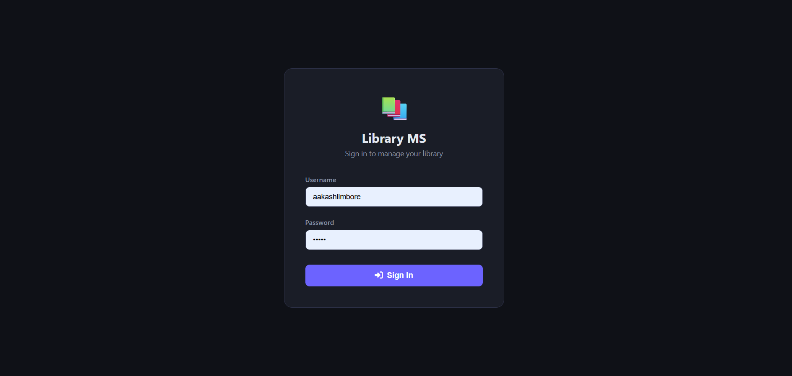
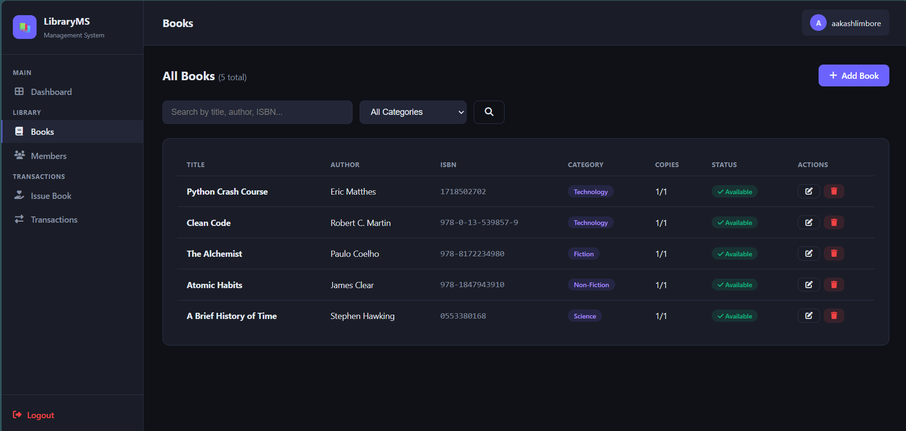
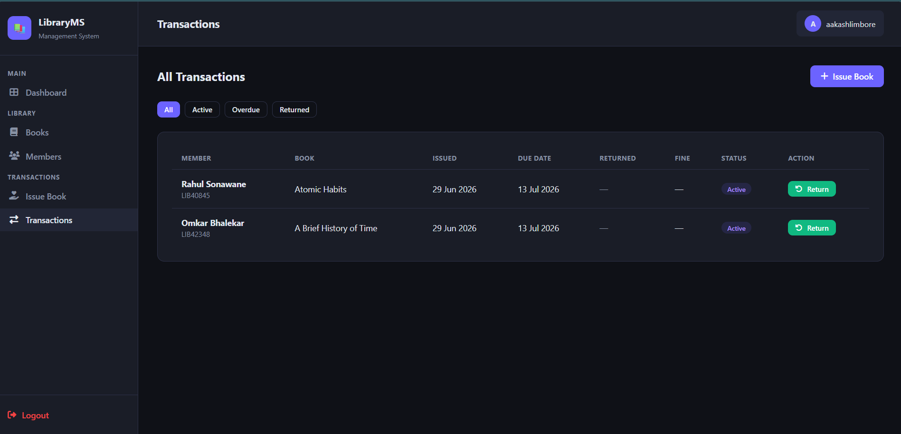

# 📚 Library Management System

A full-stack web application built with **Django** and **PostgreSQL** to manage books, members, and transactions for a library. Built as a personal project to strengthen my backend development skills.


---

## 🖥️ Screenshots

> Dashboard


> Books List


> Issue Book


> Transactions


---

## ✨ Features

- 🔐 **Authentication** — Secure login/logout for librarian
- 📚 **Book Management** — Add, edit, delete, search books by title/author/ISBN, filter by category
- 👥 **Member Management** — Register members with auto-generated Member ID
- 📖 **Book Issuing** — Issue books to members with 14-day due date
- 🔄 **Book Return** — Return books with automatic fine calculation (₹2/day after due date)
- ⚠️ **Overdue Tracking** — View all overdue books with days and fine amount
- 📊 **Dashboard** — Real-time stats — total books, members, active issues, overdue count
- 🔍 **Search & Filter** — Search members and books instantly

---

## 🛠️ Tech Stack

| Layer | Technology |
|-------|-----------|
| Backend | Python 3.11, Django 5.x |
| Frontend | HTML5, CSS3, JavaScript |
| Database | SQLite (dev) → PostgreSQL (prod) |
| Auth | Django built-in authentication |
| Icons | Font Awesome 6 |
| Hosting | Render (planned) |

---

## 🗄️ Database Design

Three core models:

```
Book
├── title, author, isbn
├── category, description
├── total_copies, available_copies
└── published_year, added_on

Member
├── name, email, phone
├── member_id (auto-generated e.g. LIB00123)
├── joined_on, is_active
└── OneToOne → User (optional login)

Transaction
├── ForeignKey → Book
├── ForeignKey → Member
├── issued_date, due_date, returned_date
├── is_returned, fine_paid
└── Properties: is_overdue, days_overdue, fine_amount
```

**Key logic:** `available_copies` automatically decrements on issue and increments on return. Fine is ₹2 per day calculated dynamically — no manual entry needed.

---

## ⚙️ Local Setup

### Prerequisites
- Python 3.9+
- pip

### Steps

```bash
# 1. Clone the repo
git clone https://github.com/akashlimbore/library-management-system.git
cd library-management-system

# 2. Create virtual environment
python -m venv venv

# Windows
venv\Scripts\activate

# Mac/Linux
source venv/bin/activate

# 3. Install dependencies
pip install -r requirements.txt

# 4. Run migrations
python manage.py migrate

# 5. Create admin user
python manage.py createsuperuser

# 6. Start server
python manage.py runserver
```

Open `http://127.0.0.1:8000` in your browser.

---

## 📁 Project Structure

```
library_project/
├── library/                  # Project config
│   ├── settings.py
│   ├── urls.py
│   └── wsgi.py
├── books/                    # Main app
│   ├── models.py             # Book, Member, Transaction
│   ├── views.py              # All views
│   ├── urls.py               # URL routing
│   └── admin.py
├── templates/                # HTML templates
│   ├── base.html             # Sidebar layout
│   ├── dashboard.html
│   ├── login.html
│   ├── books/
│   ├── members/
│   └── transactions/
├── static/                   # CSS, JS, images
├── manage.py
└── requirements.txt
```

---

## 🔮 Future Improvements

- [ ] Migrate to PostgreSQL
- [ ] Email notification when book is overdue
- [ ] PDF receipt generation on book issue/return
- [ ] Member login portal to view own transactions
- [ ] Deploy on Render with live URL
- [ ] Export transactions as CSV/Excel

---

## 💡 What I Learned

- Designing relational database schema with proper foreign keys
- Django ORM queries — filtering, aggregation, select_related
- Implementing business logic (fine calculation, copy tracking) at the model level using Python `@property`
- Building role-based views with `@login_required` decorator
- Form handling with CSRF protection in Django

---

## 👨‍💻 Author

**Akash Limbore**
- GitHub: [@akashlimbore](https://github.com/akashlimbore)
- LinkedIn: [akash-limbore](https://linkedin.com/in/akash-limbore-852241232)
- Email: akashlimbore90@gmail.com

---

## 📄 License

This project is open source and available under the [MIT License](LICENSE).
